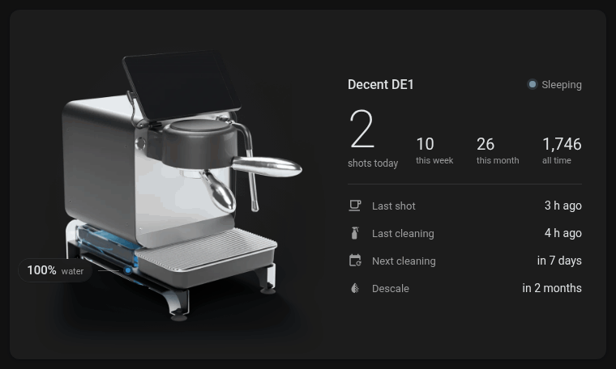
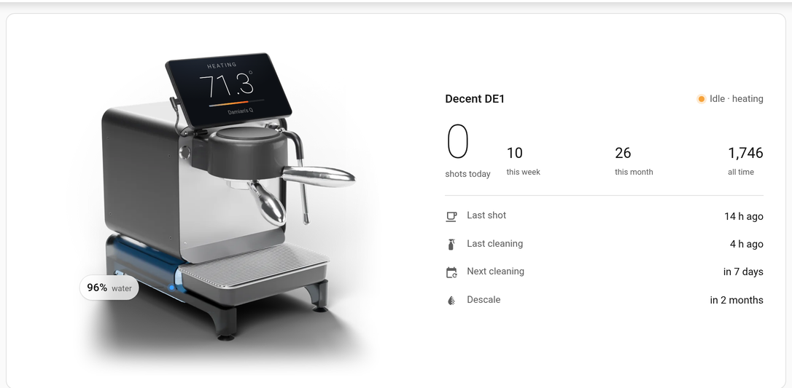
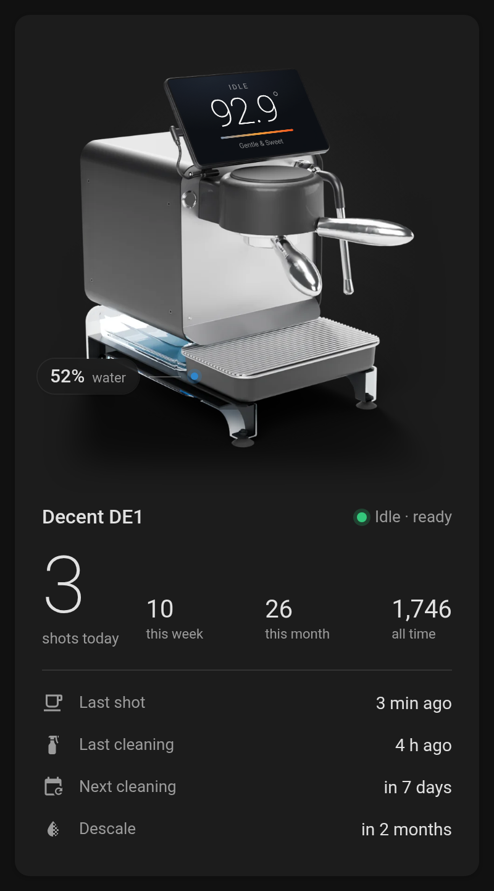

> **Disclaimer:** this is AI slop. It was built without a human ever touching the code. It works though.

# Decent DE1 Card

A Home Assistant dashboard card for the [Decent Espresso DE1](https://decentespresso.com/). The machine is a Cycles render of Decent's own published CAD model, with live data drawn onto it:

- **Tablet screen** – machine state, group temperature, a heat bar and the loaded profile, mapped onto the tablet with the correct perspective. Blank while the machine sleeps.
- **Water tank** – the base is rendered as smoked glass, and the water inside it follows the real tank level. The label turns red when water is low.
- **Stats** – shots today, this week, this month and all time, plus the last shot, last cleaning, next cleaning and descale, if you have entities for them.



| Desktop, light | Phone, dark |
|---|---|
|  |  |

It adapts to its width: machine and stats side by side on wide screens, stacked on phones. It follows the Home Assistant theme in light and dark mode. Tapping a value opens that entity's more-info dialog.

## Installation

### HACS

[](https://my.home-assistant.io/redirect/hacs_repository/?owner=DeastinY&repository=decent-de1-card&category=plugin)

Or in HACS: **⋮ → Custom repositories**, add `https://github.com/DeastinY/decent-de1-card` as type **Dashboard**. Then install **Decent DE1 Card**.

### Manual

Copy `dist/decent-de1-card.js` to `/config/www/`. Then add `/local/decent-de1-card.js` as a JavaScript module under **Settings → Dashboards → ⋮ → Resources**.

## Configuration

The card needs the machine's entities. If they share a prefix, `prefix` is enough:

```yaml
type: custom:decent-de1-card
prefix: decent_de1_
```

That resolves to:

| Option | Default entity |
|---|---|
| `state` | `sensor.<prefix>machine_state` (`Sleep`, `Idle`, `Espresso`, `Steam`, …) |
| `substate` | `sensor.<prefix>machine_substate` (`ready`, `heating`, `pouring`, …) |
| `temperature` | `sensor.<prefix>group_temperature` |
| `water_level` | `sensor.<prefix>water_level` (mm, or `%` if the sensor's unit is %) |
| `profile` | `sensor.<prefix>profile` |
| `shot_running` | `binary_sensor.<prefix>shot_running` |

Any of them can be set directly instead, for example `temperature: sensor.my_group_temp`.

The stats and care rows are optional and only appear when configured:

```yaml
type: custom:decent-de1-card
prefix: decent_de1_
shots_today: sensor.espresso_today          # e.g. a utility_meter
shots_week: sensor.espresso_this_week
shots_month: sensor.espresso_this_month
shots_total: sensor.espresso_count
last_shot: input_datetime.last_coffee       # input_datetime or timestamp sensor
last_cleaning: input_datetime.last_cleaning
cleaning_due: sensor.clean_coffee_machine   # due date in state or a `next_due_date` attribute (Donetick)
descale_due: sensor.descale_decent
```

| Option | Default | Description |
|---|---|---|
| `name` | `Decent DE1` | Title next to the status |
| `water_full_mm` | `48` | Water level (mm) that counts as a full tank |
| `water_low_mm` | `10` | Below this the water label turns red |
| `water_low_percent` | `20` | Same, for sensors reporting % |

## How the render works

`render/` has the pipeline that produced the images embedded in the card:

1. Download the official STEP file, [`DE1PROV14.STEP`](https://decentespresso.com/img/DE1PROV14.STEP) (listed on [decentespresso.com/overview](https://decentespresso.com/overview)), into `render/`.
2. `npm install occt-import-js && node convert.mjs` tessellates it into `de1.json` with part names and face colours.
3. `blender -b --python scene.py -- '{…}'` builds a studio scene with per-part materials and renders the machine once per water level (0–100 % in 10 % steps) with a transparent background. The full command is at the top of `scene.py`.
4. `python3 assets.py` crops the renders and keeps only the pixels that change with the water level. It also exports where the tablet screen and tank sit in the image, and writes `render/assets.json`.
5. `python3 build.py` embeds the assets into `dist/decent-de1-card.js`.

## Credits

The machine model comes from the CAD files [Decent Espresso publishes for free](https://decentespresso.com/blog/decent_espresso_cad_files). This project is not affiliated with or endorsed by Decent Espresso. "Decent" and "DE1" are their trademarks.
